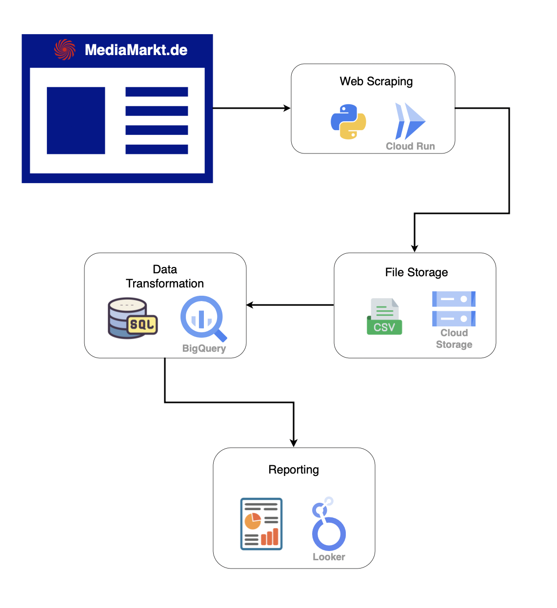
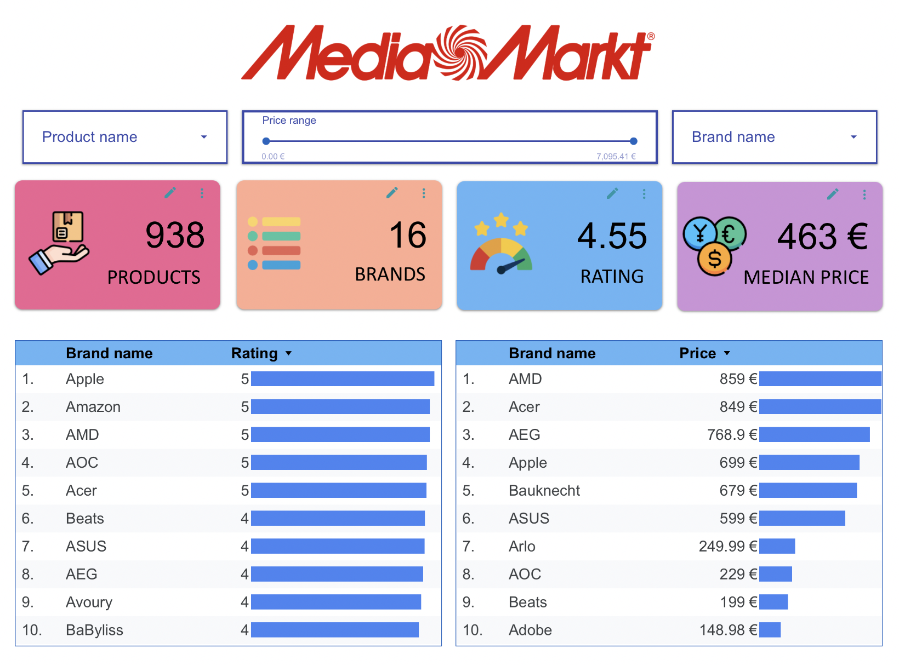

  

# MediaMarkt.de Data Analytics Project (GCP) – [Looker Dashboard 🔗](https://lookerstudio.google.com/s/tesjnh1EpHo)

This repository showcases an **end-to-end data pipeline project** built specifically to demonstrate my skills as a **Data Analyst candidate for MediaMarkt**.

> **Note on Ethics:**  
> I am fully aware that large-scale data scraping without permission is not ethical.  
> For this project, I intentionally collected only a very small sample of publicly available product information, purely for learning and demonstration purposes.

This project demonstrates proficiency in:

- 🐍 **Python** for data extraction and automation  
- 🗄️ **BigQuery SQL** for data modeling and cleaning  
- ☁️ **Cloud Run / Cloud Scheduler** for scalable pipelines  
- 📊 **Looker Studio** for visualization and reporting  

The dashboard and pipeline architecture are inspired by **real business requirements at MediaMarkt**, showing how I can turn raw data into actionable insights as a data analyst.

---

## 🏗 Architecture

The pipeline consists of the following components:

1. **[🕸 Web Scraping (Cloud Run + Python)](scraping/)**  
2. **📂 File Storage (CSV in GCP Cloud Storage)**  
3. **[🗄 Data Transformation (BigQuery SQL + Views)](gcp/)**  
4. **[📊 Reporting (Looker Studio BI)](looker/)**

---

## 🔄 Pipeline Steps

### 1. 🕸 Web Scraping – Cloud Run
- Scrapes **MediaMarkt.de** product data using Python.
- Deployed on **Cloud Run**.
- Scheduled with **Cloud Scheduler**.

### 2. 📂 File Storage – Cloud Storage
- Scraped data is exported as CSV.
- CSV files are stored in a **GCP Cloud Storage bucket**.

### 3. 🗄 Data Transformation – BigQuery
- BigQuery loads CSV data from Cloud Storage.
- **SQL scripts clean, transform, and normalize the data.**
- A clean **BigQuery view** is created for analytics.

### 4. 📊 Reporting – Looker
- Looker connects to the **BigQuery clean view**.
- Dashboards and reports are created for analytics.

---

## 🏆 Results – Looker Dashboard

The final output of this project is an **interactive Looker Studio dashboard** that provides insights on MediaMarkt products.

- **Live Dashboard:** [Click here to explore the dashboard](https://lookerstudio.google.com/s/tesjnh1EpHo)  

---

## 🛠 Technology Stack

- 🐍 **Scraping:** Python, Cloud Run  
- ☁️ **Data Storage:** Cloud Storage (CSV)  
- 🗄 **Processing:** BigQuery SQL  
- 📊 **Visualization:** Looker Studio (BI)  
- ⏱ **Orchestration:** Cloud Scheduler  
